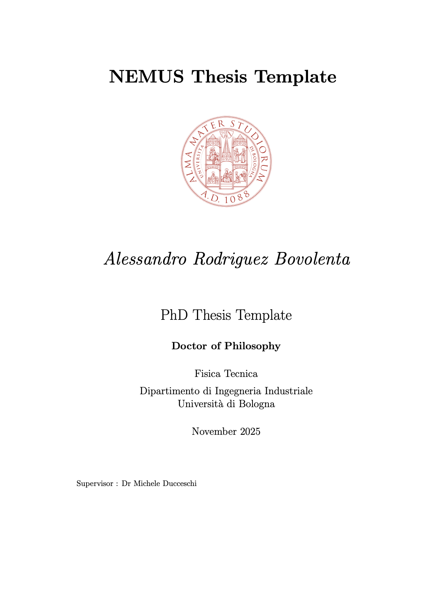

# NEMUS Thesis Template

|  |
| :--------------------------------: |
|         Example Title Page         |

## Getting started

### Overleaf


### macOS

To get started there are a few package requirements if you `brew install basictex`

```
brew install basictex
eval "$(/usr/libexec/path_helper)"
sudo tlmgr update --self
sudo tlmgr install texliveonfly
sudo tlmgr install xelatex
sudo tlmgr install adjustbox
sudo tlmgr install tcolorbox
sudo tlmgr install collectbox
sudo tlmgr install ucs
sudo tlmgr install environ
sudo tlmgr install trimspaces
sudo tlmgr install titling
sudo tlmgr install enumitem
sudo tlmgr install rsfs
sudo tlmgr install tocbibind
sudo tlmgr install appendix
sudo tlmgr install datetime
sudo tlmgr install fmtcount
sudo tlmgr install nomencl
sudo tlmgr install multirow
sudo tlmgr install siunitx
```

## Compiling

###   Shell script for PDFLaTeX (Unix/Linux)

Usage: `sh ./compile-thesis.sh [OPTIONS] main`

- [option]  `compile`: Compiles the PhD Thesis
- [option]  `clean`: removes temporary files - no filename required


## References

GILBERT, C MOLER, and R SCHREIBER. “SPARSE MATRICES IN MATLAB - DESIGN AND IMPLEMENTATION.” SIAM journal on matrix analysis and applications 13.1 (1992): 333–356. Web.

RODERICK BUCHANAN-DUNLOP, MICHAEL J. NEWTON, and MARTIN PARKER  “PERSPECTIVES ON IMMERSION THROUGH LASER DOPPLER VIBROMETRY.”
Proceedings of the Sound and Music Computing Conference (2024)

ANDREW MCPHERSON. “PORTABLE MEASUREMENT AND MAPPING OF CONTINUOUS PIANO GESTURE.” Proceedings of the International Conference on New Interfaces for Musical Expression (2013)

Carcagno, Samuele et al. “Effect of Back Wood Choice on the Perceived Quality of Steel-String Acoustic Guitars.” The Journal of the Acoustical Society of America 144.6 (2018): 3533–3547. Web.

Almanza, Victor et al. “Physics-Based Simulations for Assessing the Playability of Heritage Musical Instruments: Impact of the Soundboard Assembly Process on Its Low Frequency Behavior.” Applied acoustics 214 (2023): 109672-. Web.